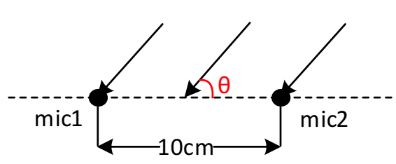
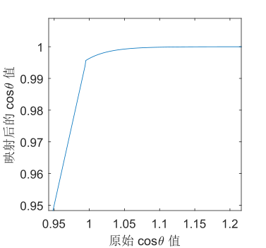

# 利用广义相关算法估计远场声源角度 实验报告

## 小组成员

单人组队：

- RainEggplant, 2017******


## 提交文件清单及说明

- aoa_estimator.py : 估计远场声源角度的主程序
- result_train.txt: 训练集上的角度估计结果
- result_test.txt: 测试集上的角度估计结果


## 代码、依赖库说明以及运行方法说明 

### 编程语言及环境

Python 3.7, Windows 10 x86

### 依赖库

- [numpy](https://numpy.org/)
- [scipy](https://www.scipy.org/install.html)
- [librosa](https://librosa.github.io/librosa/install.html)
- [noisereduce](https://pypi.org/project/noisereduce/)

### 运行方法

```
usage: aoa_estimator.py [-h] -d DIRECTORY -n NUMBER

This tool will estimate the Angle of Arrival (AoA) of the sound source from
audio files.

optional arguments:
  -h, --help            show this help message and exit
  -d DIRECTORY, --directory DIRECTORY
                        the parent directory of audio files
  -n NUMBER, --number NUMBER
                        the number of audio files
```


## 设计思路与分析

### 基本原理

判断声源的角度的基本思路是利用信号到达两个麦克风的时间差 (TDOA)。在题目的设置下（如下图），设麦克风间距为 $d=10 \text{ cm}$, 声速 $c_0=343 \text{ m/s}$，则有：


$$
d \cos(\theta)=c_0 \cdot \Delta t
$$
从而有
$$
\theta = \arccos(\frac{c_0 \cdot \Delta t}{d})
$$
获取时间差的方式是计算两个麦克风信号的相关，然后取最大值出现的位置。设两个麦克风信号的频谱分别为 $X_1(\omega), X_2(\omega)$，则相关函数可通过如下方式计算：
$$
G(\omega)=X_1(\omega) X_2^*(\omega)
$$

$$
R(\tau)=\mathcal{F^{-1}}\{G(\omega)\}
$$

$$
\hat {\tau} = \arg \max_{\tau} R(\tau)
$$


### 信号处理

但是，题目给出的音频是不能直接用于计算的，因为它存在着以下问题：

- 叠加了强噪音
- 采样率很低
- 有混响干扰

如果直接使用，结果误差会非常大。因此需要先针对这些问题进行信号处理。

#### 低切、高切

我之前曾经学习过录音与混音，一个常见的操作是使用 EQ 压低噪声、调整音色，这完全可以应用到题目中语音信号的处理上。考虑到女声的基频大致在 200 Hz - 1200 Hz 区间，再考虑到保留泛音和高频噪声的平衡，我应用了 [200 Hz, 3000 Hz] 的带通线性相位 FIR 滤波器。这样，可以去除部分低频的混响和高频噪声，而使得人声更加清晰。

这一方法对估计精度的提升效果是较显著的。我将这一方法告诉了多位同学，他们都表示结果有明显提升。

该步处理采用 `scipy.signal` 中的 `firwin` 和 `lfilter` 实现。

#### 去噪

仅作低切、高切处理是不够的，还需要处理通带内的噪声。我采用的去噪方法的原理是谱减法，即先采得一段噪声（本次作业中默认为开始处的一小段音频），计算得其频谱。然后再对音频分帧计算频谱并减去噪声谱，逆变换得去噪后的信号。

该步处理采用 `noisereduce.reduce_noise` 实现。

#### 提升采样率

题目所给的原始音频文件的采样率仅为 20000 Hz, 由此计算的延时仅有 11 种是落在有效区间的，因此必须进行升采样。

该步处理采用 `librosa.resample` 实现。

#### 非线性映射

在实验中，我发现程序得出的 $\cos \theta$ 值的绝对值有时会超过 1。分析其原因是角度越与麦克风平行，$\arccos$ 函数变化越陡峭，越难以接受误差。但是，我们仍需要尽可能给出较小误差的角度估计值。因此可以对 $\cos \theta$ 做一个非线性映射，即：
$$
\begin{equation}
\hat {\cos \theta} = 
\begin{cases}
	1-10.92 e^{24.17-32.16 \cos\theta} &, \cos \theta > 0.995 \\
	\cos \theta &, \left| \cos \theta \right| \le 0.995 \\
	-1+10.92 e^{24.17+32.16 \cos\theta} &, \cos \theta < -0.995
\end{cases}
\end{equation}
$$


这样可以使得 $\cos \theta$ 的值总是合法的，并且仍保持估计的角度 $\theta$ 对其的单调性和连续性。


## 实验结果与讨论

该程序平均 2s 分析一条音频（~~既然助教说时间不是硬要求所以我就多算一会~~）。

在训练集上运行，结果请见 `report_train.txt`。其与真实值的平均误差为 $0.957^{\circ}$ 。

在测试集上运行，结果请见 `report_test.txt`。

该程序仍有进一步优化的方向，例如加入对混响的消除、分段估计并统计等。但是对于本次题目，前面的处理已经使得误差达到了很小的程度。此时，估计精度应当主要受限于采样率，采用这些方法能提升的空间比较有限，所以并没有进行实现。